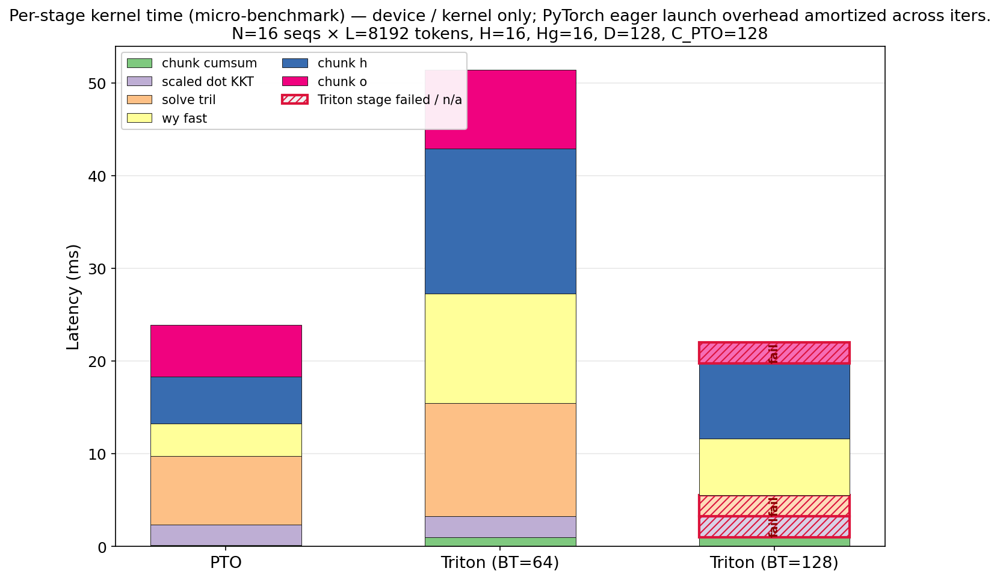
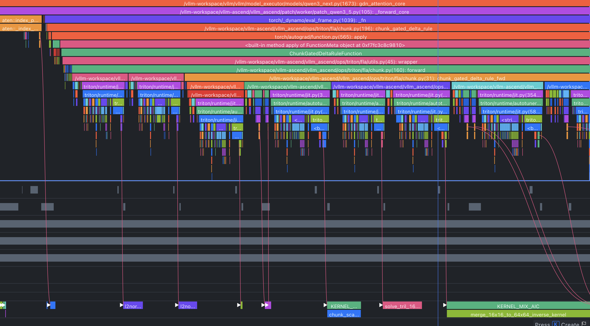
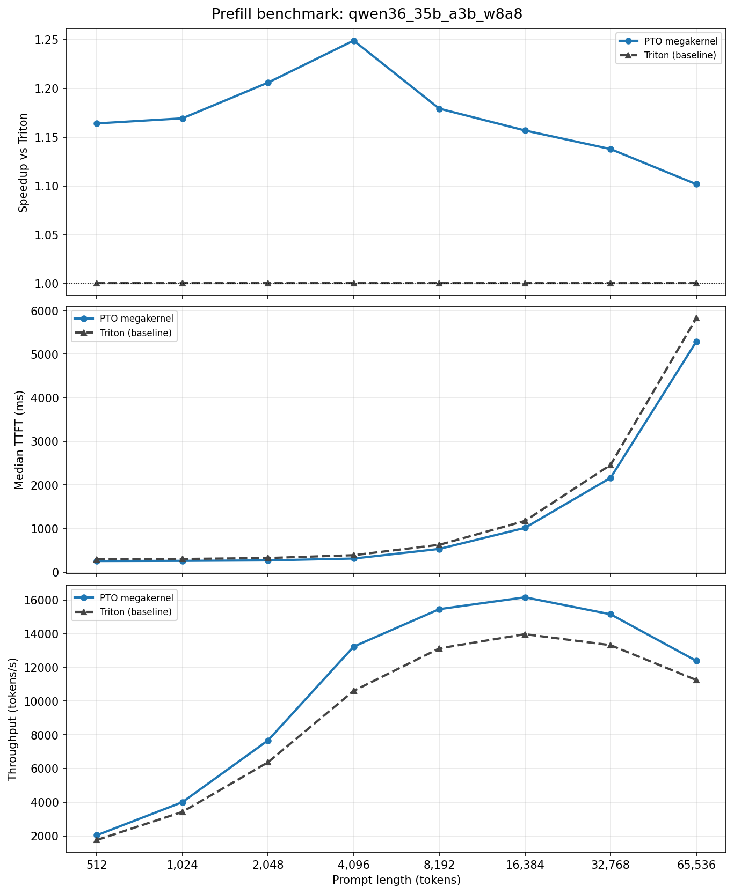
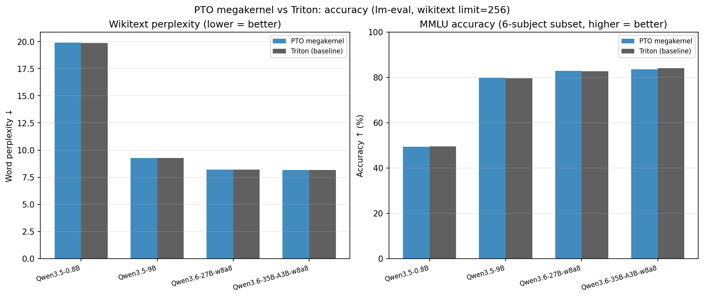

# MegaGDN: 用一个算子加速Qwen3.5/3.6推理TTFT 15% <br/> (PTO-ISA集成vLLM-Ascend实录)

**两句话总结**: 我们用PTO指令集重搓了chunk GatedDeltaNet(GDN)的所有算子，各算子相比vLLM-Ascend里的6个Triton参照平均提速**2倍**，将6个算子合并为Megakernel进一步提速1.5倍。集成进vLLM实测Qwen3.5/3.6**整网prefill TTFT 下降15%**，且**跑分精度无损**。

**复现本文全部结果**，见:
- 算子源码、性能与精度测试、vLLM-Ascend集成，均见代码仓: https://github.com/huawei-csl/megagdn-pto
- vLLM-ascend pull request: https://github.com/vllm-project/vllm-ascend/pulls (**TODO**)

# 目录

- 总体设计: 为NPU量身定做的Chunk128 GDN大算子
- 功能需求: 考虑dynamic batch动态维度 & Qwen3.5/3.6全系列shape
- 6个算子实测: PTO实现 vs Triton基线，精度与性能对比
- Megakernel: 简单改写kernel call，消除host瓶颈
- 整网实测: vLLM-ascend prefill性能实测与lm-eval跑分

# 总体设计: 为NPU量身定做的Chunk128 GDN大算子

Linear Attention系列的[chunkwise算法](https://sustcsonglin.github.io/blog/2024/deltanet-2/#a-chunkwise-algorithm-for-deltanet)最重要的参数是chunksize `C`，类似FlashAttention中的序列维度`S`，直接决定了计算访存比(arithmetic intensity)，也就决定了矩阵单元(Cube core, TensorCore)的利用率。GPU上普遍采用较小的chunk size：[FLA项目](https://github.com/fla-org/flash-linear-attention)默认用64 (Triton源码里的`BT`参数), 而[FlashKDA](https://github.com/MoonshotAI/FlashKDA/blob/master/docs/20260420-flashkda-v1-deep-dive.md)选了更小的16 -- 理由之一是三角求逆步骤的计算量为`O(C^2)`，且多出来的FLOPs不是简单的矩阵乘，chunk太大会导致求逆成为瓶颈。

我们上一篇[基于PTO指令的求逆算子优化](https://github.com/huawei-csl/gdn-tri-inverse/blob/0.1.0/markdown/fast_inverse_blog/fast_inverse_zh.md)，实现了亲和NPU矩阵单元的求逆算法，使得Chunk128的求逆不再是瓶颈，因此整个GDN可以改写成chunk128。(为什么不做chunk256? 算术密度超过了硬件roofline拐点，多出的FLOPs不再“免费”了，得不偿失)

## 对比现有Triton & TileLang样例

既然vllm-ascend和sgl-kernel-npu里有现成的Triton实现，为什么不设置`BT=128`重新编译？笔者尝试发现一些算子如`chunk_o`, `scaled_dot_kkt`报编译错误 (Tile大了导致SRAM不够，需要更细节的kernel修改)，个别如`chunk_h`可以编译通过并提升少许性能，但远不及本文的重新优化。而且chunk GDN是一个整体流程，不同阶段的chunksize需要一致，不能简单混用。本文选择绕过Triton抽象，用PTO指令级编程，进一步压榨2倍的性能。(GPU上的[cuLA](https://github.com/inclusionAI/cuLA)项目类似地也用CuteDSL重写了FLA，相比原本的Triton-GPU实现也有可观加速。)

本文还参考了tilelang-ascend的[opt_gdn](https://github.com/tile-ai/tilelang-ascend/tree/67d6a4a818e864b8cfb84e310ec568bd18b879fe/examples/linear_attention_and_rnn/opt_gdn)（仅静态shape），与[chunk_gated_delta_rule](https://github.com/tile-ai/tilelang-ascend/tree/67d6a4a818e864b8cfb84e310ec568bd18b879fe/examples/chunk_gated_delta_rule) (目前仅`chunk_h`阶段)。我们补齐了6个阶段，支持了dynamic batch下的非对齐动态shape，并直接调优PTOISA C++源码大幅改进了性能。

# 功能需求: 考虑dynamic batch动态维度 & Qwen3.5/3.6全系列shape

为了把算子集成进推理引擎，首先要明确哪些轴必须作为runtime动态shape，而哪些轴可以看作编译时确定的静态常量(可写成macro或C++ template参数，简化Tiling假设，提升性能)。

## 动态轴的处理

Batch和sequence维度显然要作为动态轴以应对prefill。我们沿用FLA kernel的命名，从推理框架向kernel传递`cu_seqlens`参数(“Cumulative Sequence Lengths”)，这是一维int数组，表示batch内每个(长度可变的)sample的起始下标，用于global memory寻址。示例如下：
- 假设`cu_seqlens = [0, 5, 8, 15]`
- 则该batch的sample数为3 (`batch_size = len(cu_seqlens)-1`)
- token数分别为 `[5, 3, 7]` (`seqlen[i] = cu_seqlens[i+1] - cu_seqlens[i]`)
- `TLOAD` & `TSTORE`指令的global memory offset需要累计的`cu_seqlens`而不是每个`seqlen`

熟悉FLA triton代码的读者会注意到Triton里还用了`chunk_indices`和`chunk_offset`这两个入参，而在我们的NPU kernel里不需要，反而看起来简单一点。这是由于多核`block_idx`的计算行为不同，在我们前一篇教程的[NPU kernel launch行为](https://github.com/huawei-csl/pto-dsl/blob/0.1.2/examples/aot/matmul_optimization_guide/matmul_optim_guide_zh.md#typical-kernel-launch-syntax)里有解释。Triton/CUDA惯用的launch grid和输入数据size成正比，例如：
- [chunk_delta_h.py里的](https://github.com/fla-org/flash-linear-attention/blob/v0.4.2/fla/ops/common/chunk_delta_h.py#L691C5-L691C61)`grid = (triton.cdiv(V, meta['BV']), N*H)`. 
- 由于`block_idx` (triton的`program_id`) 的上限不固定，每个`block_idx`到chunk下标的映射需要额外的metadata(`chunk_indices`和`chunk_offset`)辅助计算。
- 而NPU kernel惯用`block_dim = num_cores`，程序里的`block_idx`永远是`0`到`num_cores - 1`, 直接在循环内部把workload依次分配给每个核就行了。

## 静态轴的处理

Chunksize固定为128。"head数"和"embedding维度"也仅有有限的选择(取决于具体模型的尺寸)，也可以作为编译态的常量。这和FlashAttention类似，`Headdim`作为template参数，[对每个`hdim`重新编译一份](https://github.com/Dao-AILab/flash-attention/tree/v2.8.3/csrc/flash_attn/src)。

穷举[Qwen3.5](https://huggingface.co/collections/Qwen/qwen35)和[Qwen3.6](https://huggingface.co/collections/Qwen/qwen35)所有模型的shape：
- 所有模型均用 `linear_key_head_dim = 128`, `linear_value_head_dim = 128`
- 所有模型均用 `linear_num_key_heads = 16`
- `linear_num_value_heads` 取值为16, 32, 48, 64，对应模型：
    - 16: `0.8B`, `2B`
    - 32: `4B`, `9B`, `35B-A3B`
    - 48: `27B`
    - 64: `122B-A10B`, `397B-A17B`

基于以上shape组合，我们把`key_head_dim = value_head_dim = 128` 作为Macro常量，简化tiling设计。把`num_value_heads`(`H`)作为template参数，编译4份实例以支持所有模型。大致示意：

```cpp
#define GDN_D 128 // head_dim
#define GDN_C 128 // chunk_size
#define GDN_H 16  // num_key_heads

template <int32_t NumValueHeads>
AICORE void chunk_gdn_kernel(...)
```

若考虑tensor parallel切轴，shape还会变。本文先做single device kernel，通算融合也在后续计划中。

# 6个算子实测: PTO vs Triton精度与性能对比



# Megakernel: 简单改写kernel call，消除host瓶颈

## PyTorch eager的Kernel launch瓶颈

实际推理部署中，光加速kernel还不够。Atlas A2和A3服务器上，众所周知地容易被host bound。



消除host bound的标准方案是[ACL Graph](https://docs.vllm.ai/projects/ascend/en/v0.18.0/developer_guide/Design_Documents/ACL_Graph.html)，即NPU上的"CUDA graph"。可惜vLLM-ascend的图模式默认是`decode_only`，而Prefill跑的还是Torch Eager。见[ACL graph limitations](https://docs.vllm.ai/projects/ascend/en/v0.18.0/developer_guide/Design_Documents/ACL_Graph.html#limitations)。这是由于Prefill阶段的shape多变，而graph capture & replay的机制需要知道shape信息，支持动态shape只能想各种修修补补的方案，包括padding, 分bin等等。GPU上是类似的问题，见[CUDA Graph Dynamic Shapes](https://docs.nvidia.com/dl-cuda-graph/latest/torch-cuda-graph/handling-dynamic-patterns.html#dynamic-shapes)，[知乎：vllm 为什么没在 prefill 阶段支持 cuda graph？](https://www.zhihu.com/question/7987565201 )

## 暴力实现Megakernel

本文用更简单粗暴的方式避免host开销。既然我们有6个阶段的源码，每个阶段区区几百行C++，直接合并成一个NPU算子用`<<<>>>`launch一次就行了。

Stage间需要全核同步确保内存读写顺序。使用`SyncAll` https://gitcode.com/cann/pto-isa/pull/878。

合并后的代码其实并不长 -- 完整的mega kernel实现见代码仓的`megagdn-pto/kernels/pto/mega_kernel.cpp`。关键的`launch_mega_kernel`入口函数只有100多行。各stage复用了单kernel的源码，没有代码重复。

这是由于AICORE function里可以调用AICORE function。类似CUDA的__device__, 更像是inline，而没有stack pointer（不支持递归）。和复制黏贴代码是一样的效果，只是让代码看上去整洁一点。

# 整网实测: vLLM-ascend prefill性能实测与lm-eval跑分




