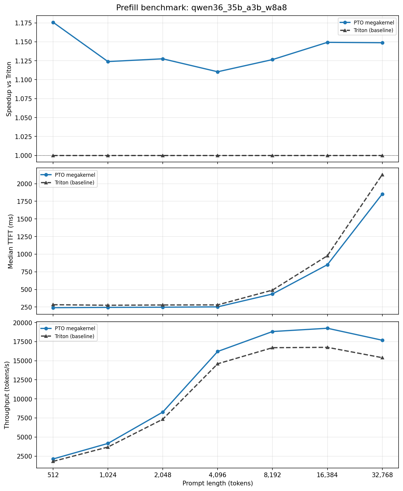

# MegaGDN：一个融合算子压低Qwen3.5/3.6推理TTFT 15% <br/> (用PTO-ISA加速vLLM-Ascend实录)

**两句话总结**: 我们用PTO指令集重搓了chunk GatedDeltaNet(GDN)的6个算子，各算子相比vLLM-Ascend里相应的Triton实现提速**1.5~3倍**。融合成Megakernel并集成进vLLM，实测Qwen3.5/3.6**整网prefill TTFT 下降约15%**，且**跑分精度无损**。

**复现本文全部内容**，见：

- 算子源码、性能与精度测试、vLLM-Ascend集成，均见代码仓：<https://github.com/huawei-csl/megagdn-pto>
- vLLM-Ascend Pull Request：https://github.com/vllm-project/vllm-ascend/pull/8872

# 目录

- [总体设计: 为NPU量身定做的Chunk-128 GDN大算子](#overall-design-chunk-128-gdn-kernel-tailored-to-the-npu)
  - [对比既有 Triton / TileLang 样例](#compared-with-existing-triton-and-tilelang-samples)
- [功能需求: dynamic batch动态维度 & Qwen3.5/3.6全系列shape](#requirements-dynamic-batch-axes-and-the-full-qwen3536-shape-matrix)
  - [动态轴的处理](#dynamic-axes)
  - [静态轴的处理](#static-axes)
- [6个算子实测: PTO实现 vs Triton基线](#six-kernels-benchmarked-pto-vs-triton)
- [Megakernel: 简单改写kernel call，消除host瓶颈](#megakernel-single-launch-to-reduce-host-overhead)
  - [PyTorch Eager模式的host开销分析](#host-overhead-in-eager-pytorch)
  - [简单粗暴实现Megakernel](#simpler-way-for-megakernel-fusion)
- [整网实测: vLLM-ascend prefill性能实测与lm-eval跑分](#full-model-results-vllm-ascend-prefill-and-lm-eval-accuracy)

<a id="overall-design-chunk-128-gdn-kernel-tailored-to-the-npu"></a>
# 总体设计: 为NPU量身定做的Chunk-128 GDN大算子

在linear attention系列架构的[chunkwise 算法](https://sustcsonglin.github.io/blog/2024/deltanet-2/#a-chunkwise-algorithm-for-deltanet)里，最核心的参数是 chunk size `C`，类比 FlashAttention 里的序列长度`S`：它决定了算术密度 (arithmetic intensity)，从而决定了矩阵单元（Cube / Tensor Core）的利用率。GPU算子选的chunk并不大：[FLA](https://github.com/fla-org/flash-linear-attention) 默认 64（Triton 源码里的 `BT`），而 [FlashKDA](https://github.com/MoonshotAI/FlashKDA/blob/master/docs/20260420-flashkda-v1-deep-dive.md) 甚至小到 16 -- 其中原因是三角矩阵求逆那步的复杂度是 `O(C^3)` FLOPs，而且并不是简单的"matmul FLOPs"；chunk 选得太大，求逆会变成瓶颈。（注： 虽然求解 $Lx = y$ 是平方复杂度，显式构造三角阵的逆 $L^{-1}$ 却是**立方复杂度**，big-O意义上等同于LU分解，只是常数项少了几倍）

我们上一篇 [亲和NPU的矩阵求逆算法](https://github.com/huawei-csl/gdn-tri-inverse/blob/0.1.0/markdown/fast_inverse_blog/fast_inverse_zh.md) 里，解决了chunk-128时的矩阵求逆瓶颈，因而整个chunk GDN算法可以按chunk_size=128重写。（为什么不用chunk-256？超过硬件roofline拐点之后，多出来的FLOPs就不再是免费午餐，实际反而更慢）

<a id="compared-with-existing-triton-and-tilelang-samples"></a>
## 对比既有 Triton / TileLang 样例

既然vllm-ascend和sgl-kernel-npu里有现成的Triton实现，为什么不设置`BT=128`重新编译？笔者尝试发现一些算子如`chunk_o`, `scaled_dot_kkt`报编译错误 (Tile大了导致SRAM不够，需要更细节的kernel修改)，个别如`chunk_h`可以编译通过并提升一些性能，但远不及本文的重新优化。而且chunk GDN是一个整体流程，不同阶段的chunksize需要一致，不能简单混用。本文选择绕过Triton抽象，用PTO指令级编程，进一步压榨两三倍的性能。(GPU上的[cuLA](https://github.com/inclusionAI/cuLA)项目类似地也用CuteDSL重写了FLA，相比原本的Triton-GPU实现也有可观加速。)

本文还参考了tilelang-ascend的[opt_gdn](https://github.com/tile-ai/tilelang-ascend/tree/67d6a4a818e864b8cfb84e310ec568bd18b879fe/examples/linear_attention_and_rnn/opt_gdn)（仅静态shape），与[chunk_gated_delta_rule](https://github.com/tile-ai/tilelang-ascend/tree/67d6a4a818e864b8cfb84e310ec568bd18b879fe/examples/chunk_gated_delta_rule) (目前仅`chunk_h`阶段)。我们补齐了6个阶段，支持了dynamic batch下的非对齐动态shape，并直接调优PTOISA C++源码大幅改进了性能。

<a id="requirements-dynamic-batch-axes-and-the-full-qwen3536-shape-matrix"></a>
# 功能需求: dynamic batch动态维度 & Qwen3.5/3.6全系列shape

为了把算子集成进推理引擎，首先要明确哪些轴必须作为runtime动态shape，而哪些轴可以看作编译时确定的静态常量(可写成macro或C++ template参数，简化Tiling假设，提升性能)。

<a id="dynamic-axes"></a>
## 动态轴的处理

Batch和sequence维度显然要作为动态轴以应对prefill。我们沿用FLA kernel的命名，从推理框架向kernel传递`cu_seqlens`参数(“Cumulative Sequence Lengths”)，这是一维int数组，表示batch内每个(长度可变的)sample的起始下标，用于global memory寻址。示例如下：
- 假设`cu_seqlens = [0, 5, 8, 15]`
- 则该batch的sample数为3 (`batch_size = len(cu_seqlens)-1`)
- token数分别为 `[5, 3, 7]` (`seqlen[i] = cu_seqlens[i+1] - cu_seqlens[i]`)
- `TLOAD` & `TSTORE`指令的global memory offset需要累计的`cu_seqlens`而不是每个`seqlen`

熟悉FLA triton代码的读者会注意到Triton里还用了`chunk_indices`和`chunk_offset`这两个入参，而在我们的NPU kernel里不需要，反而看起来简单一点。这是由于多核`block_idx`的计算行为不同，在我们前一篇教程的[NPU kernel launch行为](https://github.com/huawei-csl/pto-dsl/blob/0.1.2/examples/aot/matmul_optimization_guide/matmul_optim_guide_zh.md#typical-kernel-launch-syntax)里有解释。Triton/CUDA惯用的launch grid和输入数据size成正比，例如：
- [chunk_delta_h.py里的](https://github.com/fla-org/flash-linear-attention/blob/v0.4.2/fla/ops/common/chunk_delta_h.py#L691)`grid = (triton.cdiv(V, meta['BV']), N*H)`. 
- 由于`block_idx` (triton的`program_id`) 的上限不固定，每个`block_idx`到chunk下标的映射需要额外的metadata(`chunk_indices`和`chunk_offset`)辅助计算。
- 而NPU kernel惯用`block_dim = num_cores`，程序里的`block_idx`永远是`0`到`num_cores - 1`, 直接在循环内部把workload依次分配给每个核就行了。

<a id="static-axes"></a>
## 静态轴的处理

Chunksize固定为128。"head数"和"embedding维度"也仅有有限的选择(取决于具体模型的尺寸)，也可以作为编译态的常量。这和FlashAttention类似，`Headdim`作为template参数，[对每个`hdim`重新编译一份](https://github.com/Dao-AILab/flash-attention/tree/v2.8.3/csrc/flash_attn/src)。

穷举[Qwen3.5](https://huggingface.co/collections/Qwen/qwen35)和[Qwen3.6](https://huggingface.co/collections/Qwen/qwen35)所有模型的shape：
- 所有模型均用 `linear_key_head_dim = 128`, `linear_value_head_dim = 128`
- 所有模型均用 `linear_num_key_heads = 16`
- `linear_num_value_heads` 取值为16, 32, 48, 64，对应模型：
    - 16: `0.8B`, `2B`
    - 32: `4B`, `9B`, `35B-A3B`
    - 48: `27B`
    - 64: `122B-A10B`, `397B-A17B`

基于以上shape组合，我们把`key_head_dim = value_head_dim = 128` 作为Macro常量，简化tiling设计。把`num_value_heads`(`H`)作为template参数，编译4份实例以支持所有模型。大致示意：

```cpp
#define GDN_D 128 // head_dim
#define GDN_C 128 // chunk_size
#define GDN_H 16  // num_key_heads

template <int32_t NumValueHeads>
AICORE void chunk_gdn_kernel(...)
```

若考虑tensor parallel切轴，shape还会变。本文先做single device kernel，通算融合也在后续计划中。

<a id="six-kernels-benchmarked-pto-vs-triton"></a>
# 6个算子实测: PTO实现 vs Triton基线

以 [vllm-ascend](https://github.com/vllm-project/vllm-ascend/tree/v0.19.1rc1/vllm_ascend/ops/triton/fla) / [sgl-kernel-npu](https://github.com/sgl-project/sgl-kernel-npu/tree/2026.05.01/python/sgl_kernel_npu/sgl_kernel_npu/fla) 里的Triton算子作为基线，我们的PTO算子在 `chunk_h`、`chunk_k`、`wy_fast`这几个主要阶段提速约 **3倍**。Triton实现默认用 `chunk_size(BT) = 64`。如前所述，我们也试过把 Triton 按 `chunk_size = 128` 重新编译 -- `chunk_h` 与 `wy_fast` 会变快，但仍比我们的 PTO 版慢大约 **1.5～2倍**；而 `chunk_o` 与 `scaled_dot_kkt` 报错；`solve_tril` 只支持到 chunk 64。


（脚本复现见 `benchmarks/kernel/` 目录；更多shape配置的实测数据在 `outputs/data/` 目录）

测试平台为**910B2**；**910C**可复用同一套算子。PTO-ISA也兼容**Ascend 950**，性能测试我们会后续补齐。

<a id="megakernel-single-launch-to-reduce-host-overhead"></a>
# Megakernel: 简单改写kernel call，消除host瓶颈

<a id="host-overhead-in-eager-pytorch"></a>
## PyTorch Eager模式的host开销分析

仅靠 kernel 侧优化，仍然不足以在 Atlas A2/A3 实现显著的整网推理加速。万恶之源是pytorch eager模式的host瓶颈 (Python解释器开销 +  kernel launch 开销)。对vLLM prefill（原 Triton backend）进行profiling，会发现device timeline上的大量闲置时间：


（由 `profiling/` 目录复现）

解决NPU host瓶颈的标准方案是 [ACL Graph](https://docs.vllm.ai/projects/ascend/en/v0.18.0/developer_guide/Design_Documents/ACL_Graph.html)，相当于 NPU 上的 CUDA Graph。vLLM-Ascend 的图编译功能支持的是 **`decode_only`**；**prefill** 仍走 eager Torch。见 [ACL graph limitations](https://docs.vllm.ai/projects/ascend/en/v0.18.0/developer_guide/Design_Documents/ACL_Graph.html#limitations)。Prefill 的 tensor shape 变化频繁，而graph capture/replay 机制需要固定的shape信息；若想支持dynamic-shape graph，需要padding、bucketing等找补方案。GPU有相同的限制 -- 见 [CUDA Graph文档： dynamic shapes](https://docs.nvidia.com/dl-cuda-graph/latest/torch-cuda-graph/handling-dynamic-patterns.html#dynamic-shapes) 以及 [知乎：vllm 为什么没在 prefill 阶段支持 cuda graph？](https://www.zhihu.com/question/7987565201)。

<a id="simpler-way-for-megakernel-fusion"></a>
## 简单粗暴实现Megakernel

本文不去硬啃Prefill图模式的坑，改用更简单粗暴的方案：GDN 各阶段的源码只有几百行C++，把源码直接合并成一个NPU kernel函数，用熟悉的 `<<< >>>` 语法只 **launch 一次**。

跨阶段之间需要对所有核做同步，保证读写次序。这里用**PTO-ISA**新加的`TSyncAll`（见 [pto-isa PR](https://gitcode.com/cann/pto-isa/pull/878)）。

融合算子代码在 `megagdn-pto/kernels/pto/mega_kernel.cpp`。Megakernel的源码依然保持简短可读，并不复杂。`launch_mega_kernel` 入口只有几百行量级的代码。各阶段**复用**单算子的源文件，不需要复制黏贴。这是编译器支持的写法：一个 AICORE 函数可以调用另一个 AICORE 函数，类似 CUDA 的 `__forceinline__ __device__`。

<a id="full-model-results-vllm-ascend-prefill-and-lm-eval-accuracy"></a>
# 整网实测: vLLM-ascend prefill性能实测与lm-eval跑分

我们在 **910B2** 单卡验证了 Qwen-3.5/3.6系列的0.8B、2B、9B、27B、35B尺寸。27B 与 35B 采用 **W8A8** 量化以装进单卡64 GiB的内存。

这里重点展示 **35B** 的结果；其他尺寸的原始数据在 `outputs/data/`，由 `benchmarks/eval_acc/` 与 `benchmarks/vllm_prefill/` 复现。

基于vllm-ascend**跑lm-eval 分数无损失**，纯算子优化不影响精度。


为准确测量 prefill **TTFT**，我们使用 vLLM 内置的 `RequestStateStats` 类型里的 `first_token_latency` 指标（定义见 [vllm/v1/metrics/stats.py](https://github.com/vllm-project/vllm/blob/v0.19.1/vllm/v1/metrics/stats.py#L216)）。Median 与 mean TTFT 差别很小；下图展示 **median TTFT**。

在 **vllm-ascend 0.18** 上，我们观测到 prefill 加速 **15～25%**（平均约 **20%**），环境为 Atlas A2（单 NPU）。


在 **vllm-ascend 0.19** 上，prefill 加速约 **15%**（由于框架侧的优化，Triton baseline 与新 PTO backend 相对 0.18 都更快）。


